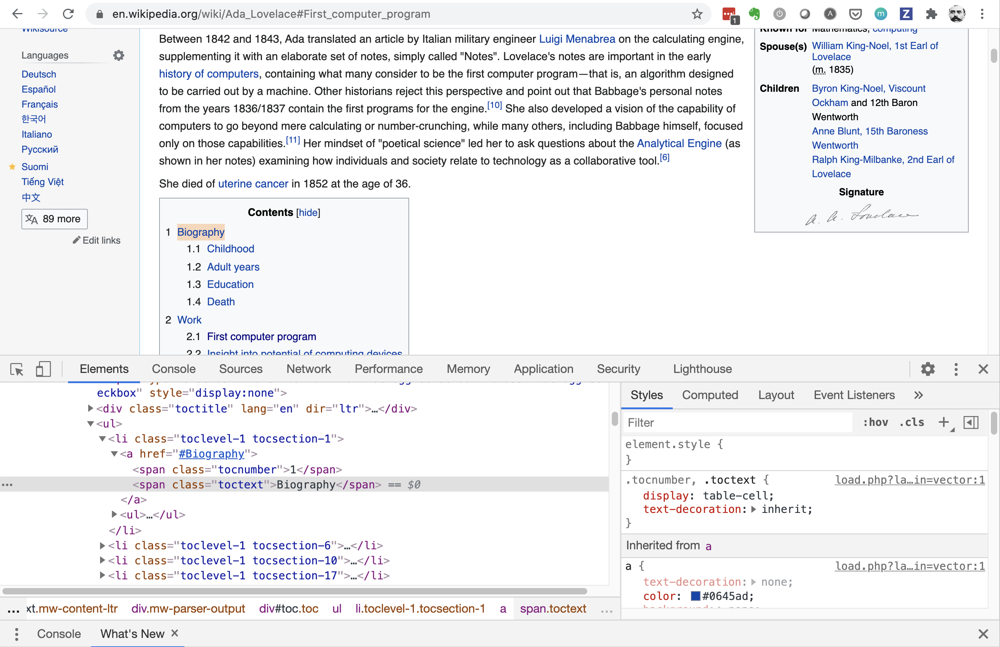

# Web-scraping in Depth

This tutorial is designed to dive deeper into the practice of web scraping, specifically, in understanding the different elements of a web page so that you'll understand how to write more complex scraping scripts on your own.

Web pages are built using text-based mark-up languages, such as HTML (or "Hypertext Markup Language"), and frequently contain lots of data in text form. Because most web pages are designed for human end-users to read, and not for programs to automatically extract, specialized scripts are needed to facilitate the scraping of web pages.

In the exercise below we'll be scraping elements from a single web page. Most people do this by copying pasting, or clicking on things to download them. At first it may seem silly to write code to do this, but it's important to start small and understand the basics. Once we've done this, the next tutorial will apply these same concepts to scraping multiple web pages at once and instantly grabbing information that would take a long time to do by hand.

It's handy to be familiar with the three basic components of a web page since you will run across them while looking deeper at web site. Very broadly, the basics of a web site include:
- [Hypertext markup language (HTML)](https://developer.mozilla.org/en-US/docs/Learn/HTML/Introduction_to_HTML): HTML is the core language of nearly all web content. It sets the rules for the web page and gives it structure. If you imagine a house being built, HTML is the framing, the walls, etc. You may also see `XML` files, which stands for "Extensible Markup Language." These are data files formatted much like HTML. For now, you don't need to worry about them too much.
- [Javascript (JS)](https://developer.mozilla.org/en-US/docs/Learn/JavaScript): JS is used to bring interactivity to a web page. Using the house analogy, JS makes sure that when you flip a switch, a light turns on.
- [Cascading style sheets (CSS)](https://developer.mozilla.org/en-US/docs/Learn/CSS/First_steps): CSS is a language used to define the presentation of a document written in HTML. It's analogous to the interior design of a house: it often defines colors, font types, etc.

## Limits of Web Scraping
- Web sites are unique, which means your scraping scripts will need to be tailored to the specific sites you want to scrape.
- Changes to a web site will likely break your script (e.g. certain elements you are scraping get renamed in the HTML of the site), and therefore
- adjustments are needed over time to keep your script up to date.

## Rules of Web Scraping
When you are scraping the web, remember that you are effectively crawling around in the guts of somebody else's web site! So it's important to understand both the rules of web scraping and the etiquette. The first rule of scraping the web is: do not harm the website. Primarily, this means that when you scrape the web, the volume and frequency of queries you make should not burden the website’s servers or interfere with the website’s normal operations. If you do this, the owner of the website might block you from having access. It's also important to remember that, just because it's on the web, doesn't mean that it's "free": make sure you are *not* violating any copyright law by extracting data that is copyrighted. If you're unsure about whether or not you can scrape a web page, trying contacting the site's administrator or [checking the robots.txt file](https://en.wikipedia.org/wiki/Robots_exclusion_standard). This is a file which is added to the root URL (web address) of most websites to define the rules for scraping that particular site. For example, go to a favorite web site and then add `/robots.txt` to the end of the URL.

Finally, it's almost never a good idea to scrape what is known as "[personally identifiable information (or "PII")](https://en.wikipedia.org/wiki/Personal_data)". PII is basically any data you can use to identify and individual, such as name, address, date of birth, etc. The [European Union's General Data Protection Regulation (GDPR)](https://gdpr.eu/), is a law that governs the use of data regarding European citizens and a large number of websites - whether or not they are based in the EU - are compliant with this law.

The exercises in this class all use web sites that specifically allow scraping, however, it's important that you understand best practices if you continue to build code to scrape the web. For more information about web scraping, [this short YouTube video](https://www.youtube.com/watch?v=vR7yH1olghs&feature=emb_logo) provides a good overview.

# Web Scraping Tutorial

The Python code below was created using Google Colab, so some of the code may differ slightly if you are working in a different environment.

## Setting Up the Environment & Our First Scrape
There are three libraries that we'll import to help us scrape. They are: beautiful soup (`bs4`), `requests`, and `lmxl`. [Requests](https://requests.readthedocs.io/en/master/) is a library that makes it much easier for your code to request information over the Internet. [Beautiful Soup](https://www.crummy.com/software/BeautifulSoup/bs4/doc/) is used for pulling data out of HTML and XML files, while [lmxl](https://lxml.de/) is used for easy handling of HTML and XML files and will be used as a parameter when we use the requests library.

Google Colab comes with a wide range of libraries already installed. You can check to see if libraries are installed using the following code:

```Python
# This example checks to see if we have bs4 installed and will return a boolean.
import sys
'bs4' in sys.modules
```
If you need to install the libraries you can use:
```Python
# install libraries
!pip install requests
!pip install lxml
!pip install bs4
```
Once that's done, you need to import the following.
```Python
# importing libraries
import requests
import bs4
```
Now we'll check to make sure everything is set up. We'll see if we can make a request and grab the code for the website http://example.com, which we are free to scrape. Run the following code:
```Python
result = requests.get("http://example.com/")
```
```Python
# check type, which will show that you've successful sent your request.
type(result)
```
The output from this should be `requests.models.Response`, which means we've received a 'response', in which case we can convert the code contained in our `result` variable into text and have a look at it with the following line of code:
```Python
# Running the following will give us all the html for that page as a Python string
result.text
```
If the output of this is a long line of garbled information that looks something like, `<!doctype html>\n<html>\n<head>\n <title>Example Domain</title>\n <meta charset="utf-8" />` congratulations you've just scraped some code from the web! However, this isn't really that easy to read, so let's parse this into something more structured and then have a look at it:

```Python
# Parse your HTML using Beautiful Soup...
soup = bs4.BeautifulSoup(result.text, "lxml") # arguments here include what we're parsing, and which engine we're using.
```

```Python
# Calling the soup shows how our parser has nicely organized the html as a "soup object" so we can see the different page elements.
soup
```
If you're not using Colab or a Jupyter notebook environment, you might need to use `print(soup)` instead of just running a code cell with `soup`. Either way, you should now see something much more structured, which might look like:
```
<!DOCTYPE html>
<html>
<head>
<title>Example Domain</title>
<meta charset="utf-8"/>
<meta content="text/html; charset=utf-8" http-equiv="Content-type"/>
<meta content="width=device-width, initial-scale=1" name="viewport"/>
<style type="text/css">
```
You can see that there are HTML "tags" in the code for this page and that these tag correspond to different elements of the page. For instance, `<title>` tells us the words "Example Domain" are the title for the page. Creating a "soup object" and using `.select` to get the element you want is a big part of scraping.  Figuring out what string syntax to pass into the `soup.select()` method is the tricky bit. Try grabbing some raw HTML elements with the following code.

```Python
# Grab some raw HTML elements: by default this will return a list that includes the tags
soup.select('title')
```
Looking good so far... but we want the text, not the tags! We'll use the select method, then specify the index place we want to work on, which is `0` since there's only one Title, then get text.

```Python
# use the select method, specify the index - 0 since there's only one, then get text.
soup.select('title')[0].getText()
```
Your output for this should simply be the string `'Example Domain'`.

### Coding challenge
Now, can you use what you've learned to select a paragraph (the HTML tag is `<p>`) and strip off the HTML tags so that you are left with the paragraph text as a string value?

*For future reference*, it's helpful to know how to grab all the elements of a class. Here's example syntax and what the matching result would be.
- `soup.select('div')` - all elements w/ "div" tag.
- `soup.select('#some_id')` - elements containing id = 'some_id'
- `soup.select('.some_class')` - elements containing class = 'some_class'
- `soup.select('div span')` - Any elements named 'span' within a div element.
- `soup.select('div > span')` - Any elements named span **directly** within a div element, with nothing in between.

## Scraping Content from Wikipedia
Now that we've got the basics of web scraping down, let's head over the Wikipedia and try to scrape more than just one thing.  Start by heading over to to Wikipedia to look at the source code. The easiest way to do this is to right-click on the page and select "Inspect element" then focus in on specific aspects of the page. We've gone over this in class, but [here's a good blog post refresher if you need it](https://blog.devmountain.com/how-to-use-inspect-element-jump-into-what-makes-a-web-page-tick/#:~:text=What%20Is%20Inspect%20Element%3F,code%20behind%20the%20web%20content.).

We'll start on this page dedicated to Ada Lovelace, the person who wrote the first computer program (back in the 1840s!): https://en.wikipedia.org/wiki/Ada_Lovelace. Our goal is to scrape the entire table of contents ("toc"); keeping only the text and not the HTML tags. So I'll start by highlighting some of the elements in the table of contents to see what the code looks like. Here's what this looked like for me using Chrome.
>

Having inspected the code in the table of contents section of the page, we can see that there is a `class="toctext"`. This is what we want to scrape.

We'll start with our request:
```Python
res = requests.get('https://en.wikipedia.org/wiki/Ada_Lovelace')
```
then make our soup.
```Python
# make our soup object
ada_soup = bs4.BeautifulSoup(res.text, "lxml")
```
You can check to make sure your soup is made... but it might be quite long!
```Python
# You can check the soup - this will be long!
ada_soup
```
Now, using our guide above, we'll grab all the elements of a class. We know there is a `class="toctext"` that we want to scrape. In other words, we want all elements containing `class="toctext"`. We'll run the following code to do this.

```Python
ada_soup.select('.toctext')
```
The output for this will be a rather long list of all the elements in the table of contents along with their HTML tags. The first part of this list will be `<span class="toctext">Biography</span>`.

Here, we'll repeat the process we did to remove the tags from the title element, above. We'll do this just to make sure we have the right code to remove the tags before writing a script that will do them all at once -  this is called 'incremental development!'

```Python
# Let's grab and inspect the first item
first_item = ada_soup.select('.toctext')[0]
```
...check to make sure we have the the first item.

```Python
first_item # could also use print(first_item)
```
```Python
# Now lets grab just the text from that first item: not HTML code.
first_item.text
```
The output for this should be the string value of `Biography` , or whatever the first section/title of the table of contents is. Our challenge now, is to write the script so that it goes through each item in the `toctext` and removes the tags. In this case, we'll use a "[for loop](https://wiki.python.org/moin/ForLoop)" to iterate through all the items and perform the same action on them.

```Python
# Iterate through all the items and print only text
for item in ada_soup.select('.toctext'):
  print(item.text)
```
Once you've run that code, you should see a return of all the sections of the table of contents without the tags. Congratulations, you've successfully scraped all the elements from the `toctext` class!

## Scraping images
Now let's grab an image. Although we generally grab images from the web by clicking on them and saving them, we're going to scrape one using Python. This may seem like the longer way of doing things, but this exercise will greatly improve our web scraping skills by getting us more familiar with identifying things we want to scrape and parsing them, and writing them as files using code.

Images on a website typically have their own URL link ending in `.jpg` or `.png`, which are the file formats they are in. Beautiful soup can scan a page, note the `` tags (used by HTML), then grab the URLs, which can be used to download images to be saved to our computer.

Always be sure you check the licensing of images you plan to use on the web. We're using a Wikipedia page here since *most* images are covered under a open source license. See [more info about images on Wikipedia here](https://en.wikipedia.org/wiki/Wikipedia:Ten_things_you_may_not_know_about_images_on_Wikipedia).

So what are we going to do?
1. Make a request.
2. Turn it into a soup.
3. Inspect the images to see what classes or element tags we need to look for.

Since she's currently somebody doing more work than anybody for democracy in America, let's get the images from [the page on Stacy Abrams](https://en.wikipedia.org/wiki/Stacey_Abrams)! As with scraping text, we'll start with a `request`, make our "soup", then parse it out to make sure we're able to scrape.

```Python
# make a fresh request for the page content
res = requests.get("https://en.wikipedia.org/wiki/Stacey_Abrams")
```

```Python
# Now, make our soup.
soup = bs4.BeautifulSoup(res.text, 'lxml')
```

```Python
soup # run this to get a structured output of HTML code.
```

Now that we've done that, we need to figure out what we're going to pass into `soup.select()`. Using the developer tools to inspect an element on the page, we can see that most images are associated with an `` tag, so let's try that.
```Python
# img is an element tag, not a class or id, so we don't need to worry about hashtags or periods.
soup.select('img')
```
If this is successful, that output should be a **list** with all the images listed starting with something that looks like this:
```

```
What we want to look at here is the `src=` tag, which shows us the URL. We can then copy that URL and paste it into a browser. In the case above, the URL is, `upload.wikimedia.org/wikipedia/en/thumb/1/1b/Semi-protection-shackle.svg/20px-Semi-protection-shackle.svg.png`. When we look at this we see a small lock... that's not a photo of Stacy! Can you find the lock on [the original page](https://en.wikipedia.org/wiki/Stacey_Abrams)?

So, while parsing our soup on `img` tags *does* result in images... we don't want them all. There can be all kinds of images in a web page: small icons, empty images included for layout purposes, the Wikipedia logo, etc. etc.

Let's try and get images *within* the article... not everywhere on the web page. Let's inspect the images again and try to hone in on classes or ids of these images.

There is something in the web page code that looks like it might be of interest... `class = "thumbimage"`. Let's have a look at just those.

```Python
# Because we're parsing a class, we'll want the . in our argument
soup.select('.thumbimage')
```
This returned 4 links, all of which are of the class `thumbimage` which is great! If we scroll through the original page, we see there are four images in the article. Again, you can check by copying/pasting the `src` from one of the images into your browser.

Now that we have those, let's see how to download the images. We'll start by creating a variable for the first image in the set.

```Python
stacy_1 = soup.select('.thumbimage')[0]
```
```Python
stacy_1 #run this to make sure have the right image.
```
Now we want to get the `src` information from within this. Remember that our new object, `stacy_1` is a "[tag object](https://www.crummy.com/software/BeautifulSoup/bs4/doc/#kinds-of-objects)", which holds all the HTML *tags* with their associated values. So we can kind of treat `stacy_1` as a dictionary (remember key/value pairs)! Try calling a few values.

```Python
# call different tags in the stacy_1 tag object
stacy_1['class']
```
```Python
stacy_1['src'] # this will return the URL we want as a string.
```
Now, make a new request based on the src url, being sure to add https: to the URL.

```Python
image_link = requests.get("https://upload.wikimedia.org/wikipedia/commons/thumb/c/c6/Stacey_abrams_at_protest.jpg/220px-Stacey_abrams_at_protest.jpg")
```
Now we're going to show the image link using a "content" attribute. This will show the image in its raw form. This isn't readable by humans, but it can be read by Python and it is the raw code of the image that we'll use to write and download a copy of the image.
```Python
# show the image link using a "content" attribute.
image_link.content
```

The output for this will look something like:
```
b'\xff\xd8\xff\xdb\x00C\x00\x04\x03\x03\x04
```
Now that we've scraped the raw image from the web, we need to write it to a new file and save it locally.

### Writing a new file
Creating a new `jpg` image requires that we open a new file, write to it, and then close it.

```Python
# Create a new file name (add .jpg or whatever matches the ned of your URL) to which we will write the file
# I'm using the variable "f" for "file"
f = open('my_stacy_image1.jpg', 'wb') # wb denotes "write binary"
```
```Python
# now we'll write all that binary content to the file. This should return some integer
f.write(image_link.content)
```
```Python
# now we close the file.
f.close()
```

So far, we've created the `jpg` file, written the raw code of the image to it, and closed it. However, it's sitting on our virtual colab workspace. So let's import our files, then download the image locally.

```Python
from google.colab import files
files.download('my_stacy_image1.jpg')
```
Now check the downloads folder on your computer. Congratulations: you've just written a file and downloaded it to your downloads folder using Python!

# What to Submit

In this tutorial we've written - step by step - instructions to scrape text and images from a Wikipedia page with successive lines of code appearing in new code blocks. Choose one of these (either scraping text or images) and convert the step by step lines of code into a single code block, including a good comment header and in-line comments. Your code should scrape a _different_ Wikimedia page for text or images than the pages we've used here. So, although you can simply re-use the code you created from the tutorial, you will need to change the URLs, and potentially the tags/elements that you're scraping. You will also need to remove the lines we used for incremental development! Those lines where we called (or printed) some variable or output just to check that we were getting results aren't needed.

When you are done, submit your notebook - the code should be in a single block or code cell so it can be run all at once - in a Github repository from your _personal account_. The`README` file in your repository should briefly explain what your code does and specify any inputs and outputs required. Feel free to add other explanation as necessary, such as any problems you encountered and how you debugged them, any interesting insights you gained from the tutorial, etc.
___
Now that we've walked through the details of web-scraping, our next tutorial will cover scraping multiple pages at once.
