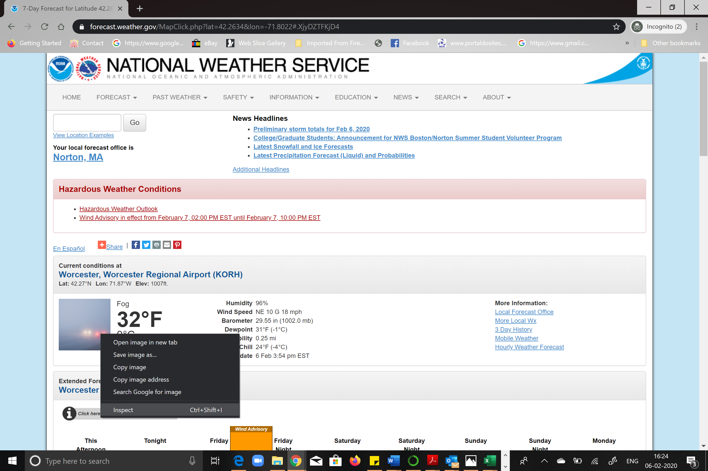
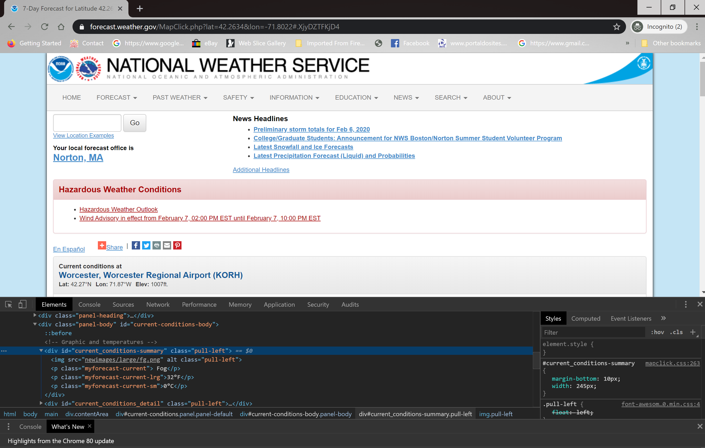

# Lab 3 – Web Scraping Weather Data
To complete this lab you will need to add a `.py` script that contains your code (be sure it is well commented!) and edit this README file.

You can write your script using whatever tolls you like, but it must include a comment block at the top with the following information:
- Name:
- Date created:
- Version of Python you are using
- Very brief description of the assignment or the assignment name. Include inputs and outputs.

You should edit your README file to provide the following information:
- Summarize what your script does or the problem you were trying to solve.
- Summarize any major errors you encountered and what sources they used to resolve the errors
- How you fixed the errors, or where the error is if you couldn't figure something out.

Remember that you are encouraged to look for answers online! Stackoverflow, other Github repositories, or Python documentation are all good places to start.

## The Code
In this lab, you will work with a script that extracts live weather conditions from the National Weather Service website for a given location in the United States. The script, `weather-scraping.py` is included in this repo.

1. Read the description and comments in the script to understand the purpose of the script and how it works.
2. Run the script. You will see some packages being installed in the compiler window when you run it for the first time.  The script returns the current weather conditions for Worcester, MA (Lat: 42.2634, Lon: -71.8022) with the latitude and longitude information provided in the script. Using the latitude and longitude values, it generates the following URL through string concatenation: https://forecast.weather.gov/MapClick.php?lat=42.2634&lon=-71.8022
3. Open this URL in a Firefox or Chrome web browser. Locate the information that is being outputted in our script. Right-click on this and select the Inspect Element option.

This will launch the Inspector window that helps locate different elements on the page

4. Locate the current_conditions-summary `id` tag on the page.

The script returns the current weather conditions for Worcester, MA (Lat: 42.2634, Lon: -71.8022) with the latitude and longitude information provided in the script. Using the latitude and longitude values, it generates the following URL through string concatenation: https://forecast.weather.gov/MapClick.php?lat=42.2634&lon=-71.8022

**Edit the Web Scraping script to do the following:**
- Edit the `lat` and `lon` variables with latitude and longitude (in decimal degrees) for a city of your choice. Note that the city must be located in the United States. If latitude/longitude for a city that is outside the U.S. is specified, the page will return an error. You can find the latitude and longitude for a place of interest through this online geocoder: https://www.latlong.net/
- In the web-page, find the `id` element that contains the Humidity, Wind Speed, Barometer, Dewpoint, Visibility and Last Updated information. Edit line #35 in the script to scrape this `id` element. The final output for the script should include the Humidity, Wind Speed, Barometer, Dewpoint, Visibility and Last Updated information for the selected city.
